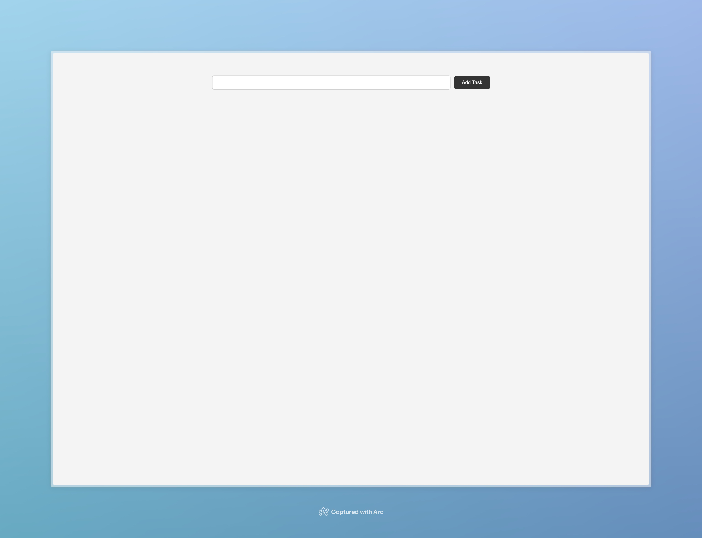
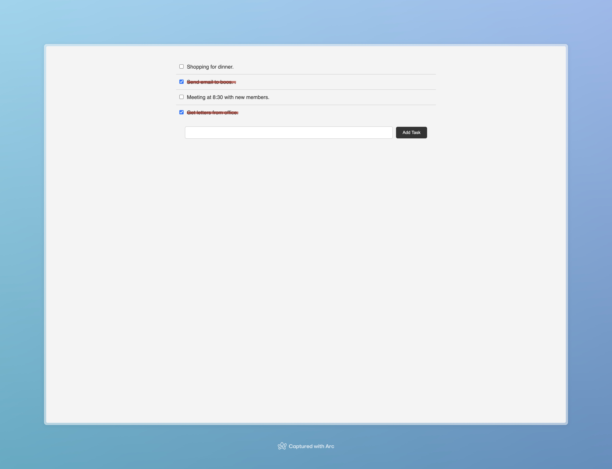

# ToDo App - A simple Todo app using TypeScript

This is a simple Todo app using TypeScript. It is a simple app that allows you to add and mark as complete a todo item.

## Technologies

- TypeScript
- HTML
- CSS

## Images

## How to run

- Clone the repository
- Run `npm install`
- Run `npm start`

## Author

- [Tenzin Kunchok](https://tenzin.tibet.dev)

## License

This project is open source and available under the [MIT License](LICENSE).
